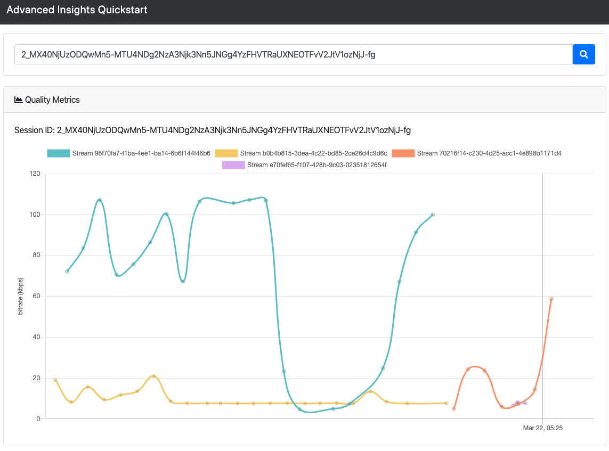

# Advanced Insights Quickstart
Get started with Advanced Insights by building a quality metrics chart for a specific session
This project provides an example of a dashboard built which allows the user to search for a specific session ID and return a graph showing publisher video bitrate by stream over time. 

## Local Installation

1. Clone the repository.

2. If you are using nvm, run `nvm use` to use the version of Node from the .nvmrc file.

3. Install dependencies: `npm install`.

4. Copy `.env.template` to `.env` and edit the environment variables.

5. Run the server and the client app: `npm start`. This will run both
   the server (server.js) and the client app (react-scripts).

Open http://localhost:3000 in your browser.

## Configuration options

Configuration can be done using environment variables. You can create
an `.env` file for easier config.

Environment Variable Names and Description:

- `REACT_APP_INSIGHTS_URL` (Required): The URL for the OpenTok Insights API server.
- `REACT_APP_API_KEY` (Required): Your OpenTok API Key.
- `API_SECRET` (Required): Your OpenTok API Secret.
- `SERVER_PORT` (Required): The port number for your server to run on.
- `REACT_APP_SERVER_URL` (Required): The URL for your server app.
- `APP_CLIENT_URL` (Required): The URL for your client app.

Notice that all the environment variables used by the client start with `REACT_APP_`.
This ensures that only those are accessible by the client, protecting your API secret.

## Quality Metrics Chart
A publisher bitrate chart similar to the component that can be found on the Inspector Tool.


#### Query for getting publisher video bitrate by stream
```
{
  project(projectId: ${apiKey}) {
   sessionData {
    sessions(sessionIds: [${sessionIds}]) {
      resources {
        meetings {
          resources {
            publishers {
              resources {
                stream {
                  streamId
                }
                streamStatsCollection {
                  resources {
                    videoBitrateKbps
                    createdAt
                  }
                }
              }
            }
          }
        }
      }  
    }
   }
  }
}
```
See our [developer documentation](https://tokbox.com/developer/guides/insights/#obtaining-session-data-advanced-insights-) for more information on Advanced Insights queries. 

## Getting Help

We love to hear from you so if you have questions, comments or find a bug in the project, let us know! You can either:

- Open an issue on this repository
- Tweet at us! We're [@NexmoDev on Twitter](https://twitter.com/NexmoDev)
- Or [join the Nexmo Community Slack](https://developer.nexmo.com/community/slack)

## Further Reading

- Other Advanced Insights resources: [Using Apollo to Query GraphQL from Node.js](https://www.nexmo.com/blog/2020/03/12/using-apollo-to-query-graphql-from-node-js-dr)
- [Developer documentation for Insights and Advanced Insights](https://tokbox.com/developer/guides/insights)
- Check out the Vonage Video Developer Documentation at <https://tokbox.com/developer/>


